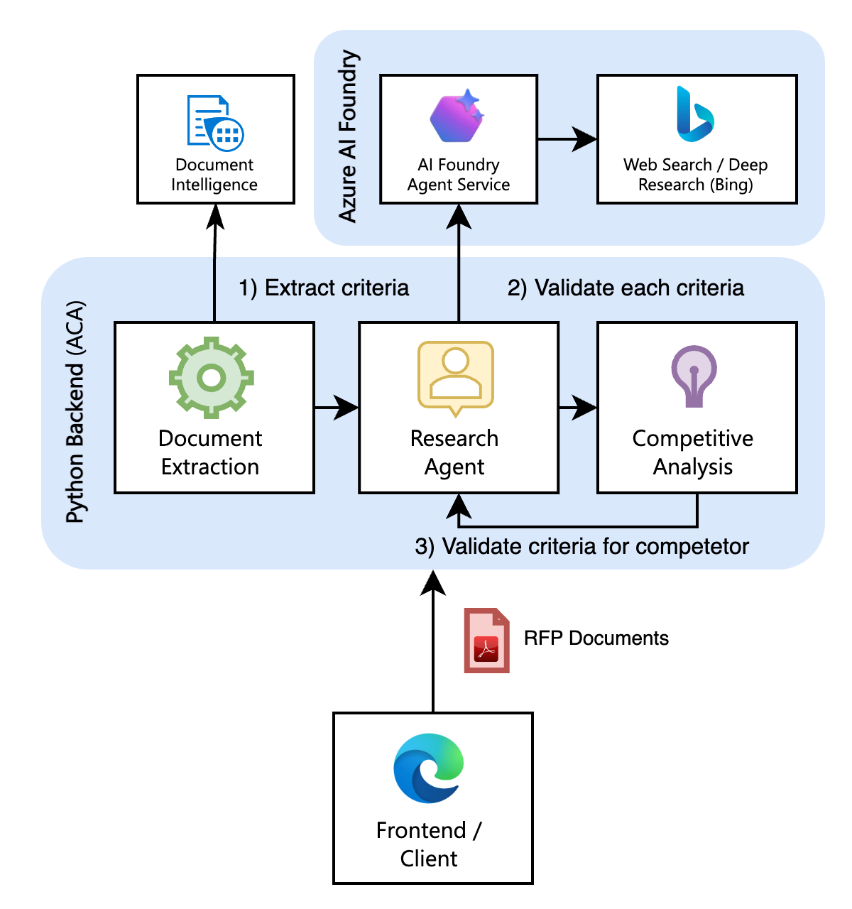

> [!NOTE]  
> This project is a envisioning-demo only. For a prodcuction-ready solution, please refer to: https://github.com/microsoft/agent-for-rfp-response-solution-accelerator
> Do not deploy this demo outside of UX ideation and testing purposes. It is not intended for production use.
> 
<div align="center">

# RFP Agent

*AI-Powered RFP Processing & Response Generation Demo*



</div>


## Overview

This repository is a **demo** for automating RFP (Request for Proposal) document processing and response generation. Built with a multi-agent architecture, it streamlines the entire RFP workflow from document upload to competitive analysis and final response package generation.

### Agent Workflow Demo

The demo automatically orchestrates a 6-step process:

1. **📦 Product Specification** - Define your solution you would like to assess against RFP criteria.
2. **📤 Document Upload** - Process RFP documents and identify requirements sections
3. **🔍 Criteria Extraction** - AI extracts and categorizes RFP criteria automatically
4. **✨ Response Generation** - Generate compliant responses with supporting evidence
5. **📈 Competitive Analysis** - Compare against competitor solutions strategically
6. **📄 Export Package** - Create submission draft documents

### Prerequisites

```bash
# Python 3.11 or higher
python --version

# Azure CLI (for deployment)
az --version
```

### Installation

```bash
# Clone the repository
git clone https://github.com/aymenfurter/rfp-agent.git
cd rfp-agent

# Install dependencies
pip install -r requirements.txt

# Set up environment variables
cp .env.example .env
# Edit .env with your Azure credentials
```

### Run the Application

```bash
# Start the development server
python main.py 

# Access the web interface
open http://localhost:8000
```